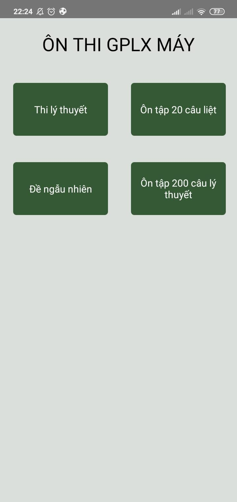
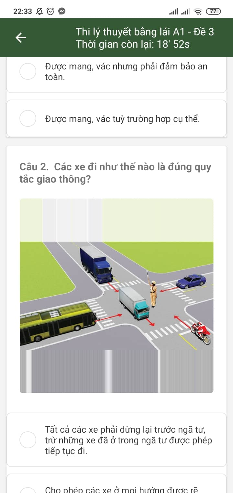
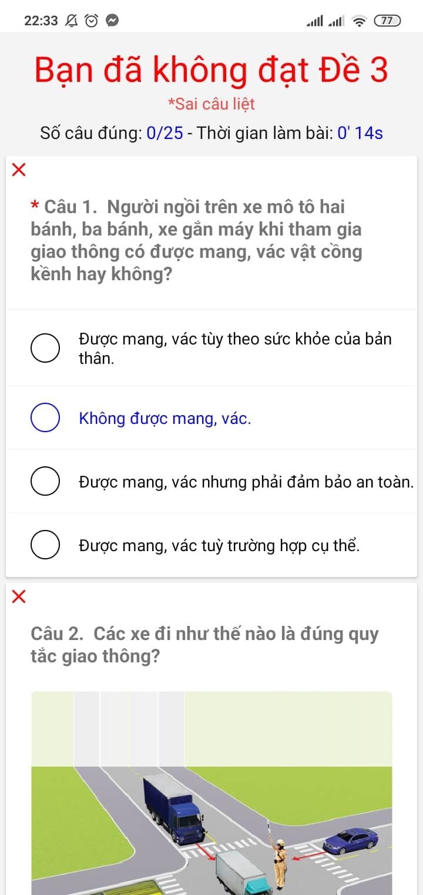
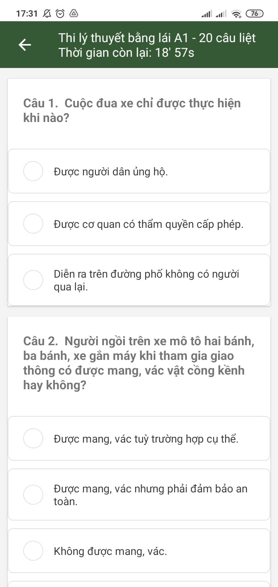
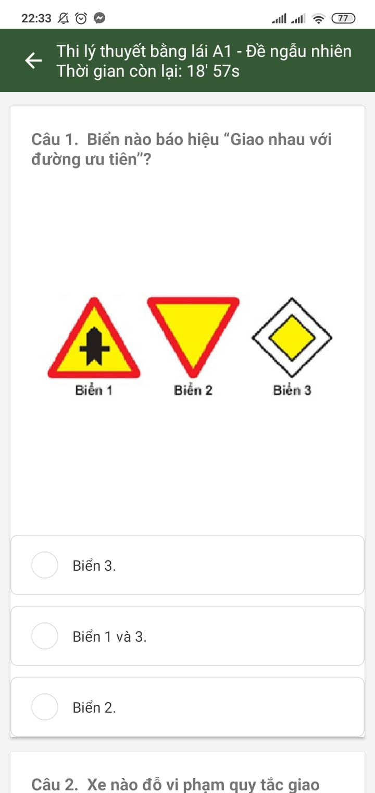
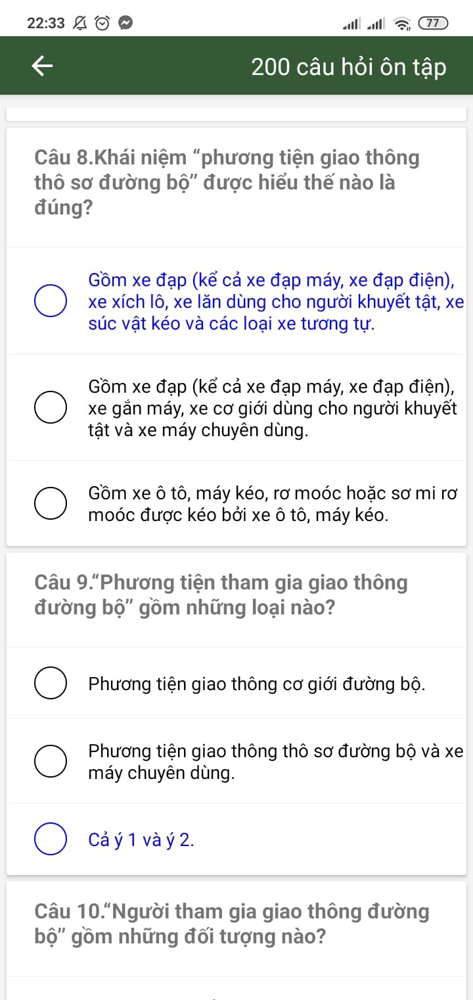

# Ứng dụng luyện thi giấy phép lái xe máy

Ứng dụng giúp bạn luyện thi giấy phép lái xe máy.

## Nội dung
1. [Chức năng](#chức-năng)
   
   1. [Thi lý thuyết](#thi-lý-thuyết)

   1. [Thi 20 câu liệt](#thi-20-câu-liệt)
   
   1. [Thi đề ngẫu nhiên](#thi-đề-ngẫu-nhiên)
   
   1. [Ôn tập 200 câu lý thuyết](#ôn-tập-200-câu-lý-thuyết)
   
1. [Yêu cầu thiết bị](#yêu-cầu-thiết-bị)

1. [Thư viện và công nghệ](#thư-viện-và-công-nghệ)

1. [Tác giả](#tác-giả)

## Chức năng
### Thi lý thuyết
   * Thi theo những đề đã tạo sẵn. Mỗi lần thi câu hỏi đáp án sẽ được trộn thứ tự. Chấm điểm dựa theo yêu cầu của thi giấy phép lái xe máy A1 21/25 câu và không sai câu liệt.
   
   

      
   

   
### Thi 20 câu liệt
   * Do câu liệt có tính chất quan trọng không được sai. Do đó chức năng này giúp dường dùng có thể ôn tập những câu này chắc chắn hơn. Đề được tạo từ những câu liệt trong bộ câu hỏi
   
   

   
   

   
### Thi đề ngẫu nhiên   
   * Ngoài ôn tập từ những đề đã được tạo sẵn. Đây là chức năng tạo ra những đề ngẫu nhiên dựa vào bộ câu hỏi và cấu trúc đề thi A1 giúp người dùng không bị giới hạn về số đề ôn
   
   

   
   

   
### Ôn tập 200 câu lý thuyết
   * Đây là chức năng giúp người dùng tra cứu, học 200 câu hỏi lý của thi giấy phép lái xe A1
   
   

   
   

   
## Yêu cầu thiết bị
-Android:
   
   +Min sdk : 21

   +Target sdk : 31

## Thư viện và công nghệ

- Language : JavaScript - React Native

- Database: Firebase

## Tác giả
- Nguyễn Văn Minh - 1752057@gm.uit.edu.vn

- Nguyễn Duy Tân - 17521014@gm.uit.edu.vn

